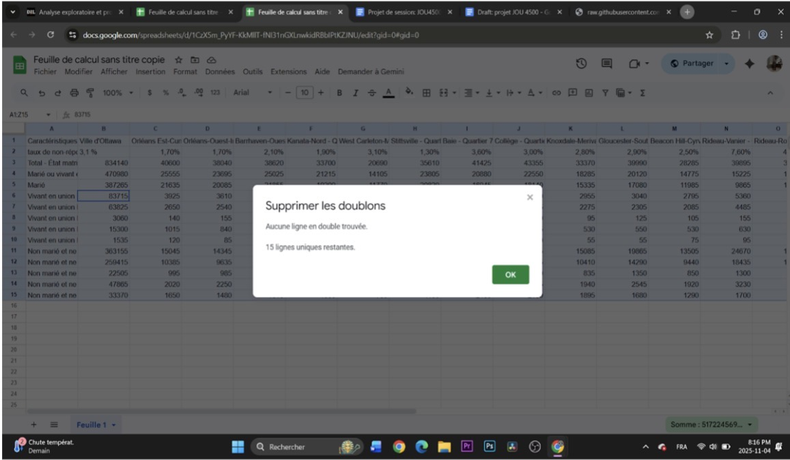
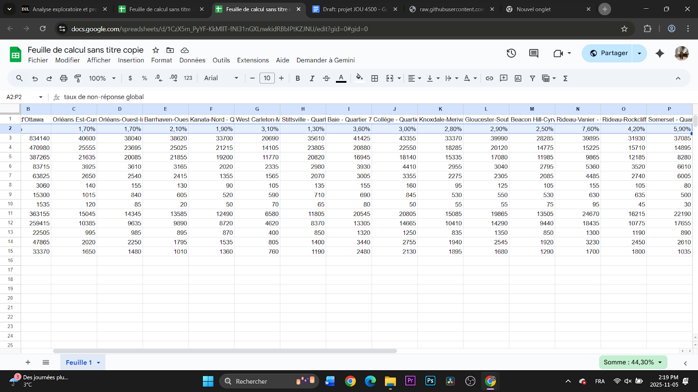
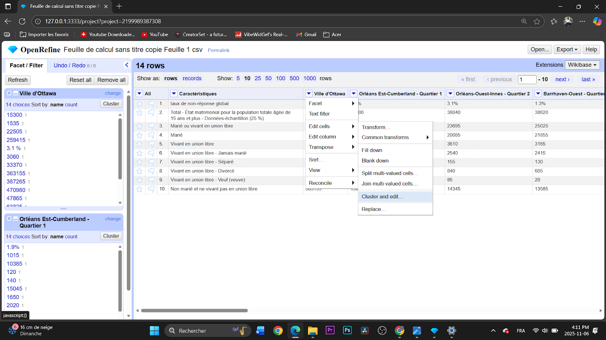

**Date** : 11 novembre 2025  
**Cote et nom du cours** : JOU4500 Journalisme Numerique II 
**Prénom et nom de l'étudiant** : Geoffroy Louké, Toussaint Gachenel & Juste Norgela Okana Ngambou 
**Présenté à Jean-Sébastien Marier** 

# Analyse exploratoire de données (AED) et proposition

## 1. Introduction

Dans le cadre de ce travail, nous analyserons un jeu de données de la Ville d’Ottawa portant sur l’enjeu suivant : l’état matrimonial de la population âgée de 15 ans et plus, selon les différents quartiers de la ville. L’objectif est d’observer comment les situations matrimoniales (célibataire, marié(e), séparé(e), divorcé(e), veuf/veuve) varient d’un quartier à l’autre et d’identifier des tendances démographiques ou des disparités territoriales.
Le jeu de données utilisé s’intitule Questionnaire détaillé du recensement de 2021 – Données par quartier. Il s’agit d’un ensemble de données dérivé du Recensement de Statistique Canada, obtenu à partir du questionnaire détaillé complété par un échantillon approximatif de 25 % des ménages.
Ce jeu de données :
* a été collecté dans le cadre du Recensement de la population 2021 réalisé par Statistique Canada ;
* *ventile les résultats par quartier municipal, permettant de comparer les réalités démographiques entre zones géographiques ;
* inclut des indicateurs sociodémographiques détaillés, dont l’état matrimonial, le niveau de scolarité, le revenu, les caractéristiques du logement et d’autres variables liées à la composition des ménages ;
* est fourni en format CSV via le portail de données ouvertes, ce qui permet d’effectuer des analyses statistiques et visuelles.

Liens  
Jeu de données original (Ville d’Ottawa) : https://ouverte.ottawa.ca/datasets/ottawa::questionnaire-détaillé-du-recensement-de-2021-données-par-quartier/about  
CSV sur GitHub: https://raw.githubusercontent.com/jsmarier/files-for-course-assignments/refs/heads/main/Questionnaire_détaillé_du_recensement_de_2021_Données_par_quartier.csv 

Ce travail sera structuré en plusieurs étapes. Dans un premier temps, nous expliquerons le processus d’obtention des données, incluant l’accès au jeu de données de la Ville d’Ottawa et sa source (le recensement de 2021 de Statistique Canada). Ensuite, nous procéderons au nettoyage et à la préparation des données, ce qui comprend la sélection des variables liées à l’état matrimonial, l’organisation des valeurs et la vérification de la qualité des données. Une troisième section sera consacrée à l’analyse descriptive, où nous analyserons la distribution des différents états matrimoniaux pour la population âgée de 15 ans et plus selon les quartiers. Finalement, nous présenterons les résultats et leur interprétation, en soulignant les variations observées entre les quartiers et les pistes de réflexion que ces différences permettent d’envisager.

## 2. Obtenir les données

Pour cette activité, on a choisi d'utiliser le fichier CSV intitulé « Questionnaire détaillé du recensement de 2021 - Données par quartier. », qui présente des statistiques de la Ville d'Ottawa, classées par quartier.

Importation des données dans Google Feuilles de calcul :

On a d'abord ouvert Google Feuilles de calcul et créé une nouvelle feuille. Dans le menu principal, on a sélectionné : 1- Fichier, 2- Importer, 3- on a sélectionné le fichier CSV depuis le bureau de l’appareil. 4 - enfin, on a importé le fichier CSV fourni.

Une fenêtre d'options s'est indiquée : on a choisi Remplacer la feuille actuelle, le séparateur automatique (virgule), et cocher Convertir les nombres et dates. Après avoir cliqué sur Importer les données, le jeu de données est apparu corrigé.

*Figure 1 : Données brutes detaillées sur l'état matrimonial, dans Google Feuilles de calcul.*

Lien vers le document CSV :
https://raw.githubusercontent.com/jsmarier/files-for-course-assignments/refs/heads/main/Questionnaire_détaillé_du_recensement_de_2021_Données_par_quartier.csv 

Observations générales :

Le fichier contient environ 26 colonnes et 2603 lignes. Les données semblent généralement propres, bien structurées et sans cellules vides majeures. Chaque colonne correspond à un quartier de la Ville d'Ottawa et chaque ligne contient une variable spécifique provenant du recensement (ex. population, âge médian, revenu, langue, etc).

Observations spécifiques : 

Colonne A : Nom du quartier : variable nominal représentant le nom administratif de chaque secteur. Aucune valeur manquante n'est observée.

Colonne B : Population totale : variable discrète quantitative (valeurs entières). On remarque des écarts importants entre les quartiers centraux et périphériques.

Colonne C : Revenu médian : variable quantitatif poursuivre. Certaines vailleurs paraissant élevées ou faibles, ce qui reflète probablement la diversité socioéconomique des quartiers.

Question ou hypothèse : 

Les quartiers centraux présentent une proportion plus élevée de personnes non mariées (jeunes professionnels, étudiants, locataires), tandis que les quartiers périphériques affichent une proportion plus élevée de personnes mariées (familles, propriétaires).

## 3. Comprendre les données

### 3.1. Analyse VIMA

En premier lieu, dans le cadre de notre analyse VIMA, nous avons observé plusieurs colonnes dont trois clés que nous avons choisies dans notre jeu de données : la population âgée de 15 ans et plus, le taux de non-réponse global, ainsi que la catégorie “marié ou vivant en union libre". Dans l’ensemble, nous avons remarqué que les données sont appropriées et reflètent des ordres de grandeur concret pour les différents quartiers dans la ville d’Ottawa. Le nombre total de la population, qui se situe entre 20 000 et 40 000 personnes selon les secteurs, correspond avec les proportions observées dans les catégories en lien avec l’état matrimonial. Ensuite, nous avons relevé aucune valeur invalide, malgré de minuscules écarts liés aux arrondis statistiques sont présents entre certaines sous-catégories et leurs totaux. Ces alternances restent de tout manière petites et n’affectent pas la fiabilité générale des données. Bien que nul des valeurs manquantes ne soit explicitement indiquée, on à observer que les écarts dans les taux de non-réponse, comme celle de Rideau-Vanier (7,6%) et à Somerset (5,9%), suggèrent une prudence particulière lors de l’interprétation. En fin de compte, aucune valeur anormale n’a été observée, et l'ensemble des données reste approprié aux tendances démographiques considérées. En terme globale, nous jugeons le jeu de données solide, tout en reconnaissant certaines limites liées à la qualité de réponse dans certains quartiers.

### 3.2. Nettoyage des données

Méthode 1: Nettoyage dans Google Sheets

1) Suppression des doublons

Nous avons utilisé l'outil Données et Supprimer les doublons, qui nous a permis d’éliminer tous les doubles lignes identiques créées lors d’une fusion de fichiers. 

*Figure 3 : Resultat de la suppression des doublons dans Google Feuilles de calcul.* 

2) Recherche et remplacer
Nous avons corrigé automatiquement certaines erreurs répétitives, comme (1,70) les donnés écrites avec une virgule au lieu d’un point.

*Figure 3 : Feuille de calcl avant le retait de la virgule.*  

-1.png>)
*Figure 4 : Feuille de calcl apres le retait de la virgule.*  

3) Vérification des totaux avec SUM

Pour vérifier la cohérence de nos données, nous avons utilisé la fonction `SUM` avec la formule =SUM(B4:B10) afin de calculer la somme des populations de tous les quartiers. Nous avons obtenu un total de 917 855, à comparer avec le total officiel de la Ville d’Ottawa de 834 140. La différence s’explique par les arrondis statistiques et les petites non-réponses dans certains quartiers. Cette vérification nous permet de confirmer que nos données sont globalement fiables et que nous pouvons les utiliser pour analyser l’état matrimonial et les tendances démographiques par quartier.

*Figure 5 : Vérification des totaux des populations par état matrinonial à Ottawa.*  

4) Nettoyage cluster à l’aide de Open Refine
Dans le cadre de notre processus de nettoyage des données, nous avons tenté la méthode de clustering dans OpenRefine, comme suggéré dans les demandes du travail dans le but de trouver et corriger les incohérences ou les variations d’écriture dans des ensembles de données volumineuses. Nous avons import le fichier csv dans OpenRefine, mais avant cela il est important de préciser que nous avons seulement prit les lignes qui sont importantes pour nous, donc les données dans notre jeux de données étaient les lignes 48 à 60,  après cela, il ne nous a donné aucune suggestion pour fusionner ou corriger les écrits que ce soit pour les quartiers ou les noms de villes. Cela nous à laissé comprendre que le jeu de données était déjà pratiquement déjà bien rédigée sans mots où variables répétitives. Malgré que nous n’avons pas effectué des changements nous avons pris des captures d’écrans qui démontrent le non demandement de changement des données affichant même parfois des chiffres auquel aucune modification n’était valable. Cela, nous à laisser avec l’idée que le jeu de données était plus où moins cohérent et ceci réduit les risques d’erreurs vis-à-vis de variations d’écriture ou des doublons cachés.
Capture d’écrans du nettoyage dans OpenRefine:
 
 
 .png>) 
 

.png>)
*Figure 6 : Captures d'écran du precessus de nettoyage et de clustering dans OpenRefine*  

### 3.3. Analyse exploratoire des données (AED)

.png>)
*Figure 7 : Tableau croisé dynamique des catégories d'état matrimonial pour les qurtiers de Somerest et Barrhaven.* 

 
*Figure 8 : Ce graphique à barres montre la distribution de l'état matrimonial des residents de 15 ans et plus dans les qurtiers Somerest et Barrhaven à Ottawa en 2021*  

Résumé de l’analyse:

Dans cette analyse exploratoire des données, nous avons décidé de nous concentrer sur les variables liées à l’état matrimonial dans les quartiers Somerset (14) et Barrhaven-Ouest (3). La raison pour laquelle nous avons choisi ces deux quartiers et ces valeurs, c'est à cause de leur richesse descriptive qui offre un cadre très ouvert à l’analyse sociale très facile à comparer ces deux secteurs qui ont des réalités démographiques hétérogènes. Le tableau croisé permet dans un premier temps d’observer activement la répartition des populations selon différents statuts conjugaux, pendant que le graphique exploratoire clarifie clairement de manière visuelle et lisible les écarts les plus significatifs. Nos premières observations montrent que Barrhaven-Ouest (3) affiche un chiffre principalement élevé de personnes mariées (25 025), surpassant énormément le quartier de Somerset (14) qui en contient (14 895). De plus, nous avons remarqué que les gens habitant en union libre se démarquent aussi à leur manière, Somerset (14) affichant pratiquement le double de personnes vivant en union libre par rapport à Barrhaven-Ouest (3) qui en comptent (3 165) et eux (6 610). Le phénomène que nous avons pu y tirées est celui de deux quartier dynamiques familiales opposées, l’un est plus tendu vers des couples mariées et 
sans doute plus stables, alors que l’autre est marqué par une diversité de statuts conjugaux et une présence accentuée de personnes vivant sous le statut de célibataires. Sur la base de ces premières tendances, elle suggère qu’une analyse plus poussée pourrait porter sur l’âge, la composition de foyer stable ou le salaire médian, pour mieux comprendre les facteurs socio-économiques qui influencent ces différences.

## 4. Récit potentiel

Titre : Ottawa à deux vitesses : banlieues conjugales et cœurs urbains célibataires
Les chiffres montrent une ville où la géographie conjugale est nette : les quartiers périphériques concentrent les familles et les personnes mariées, tandis que le centre attire des adultes célibataires et des formes de vie plus individuelles. Ce récit peut analyser comment le logement (prix, type), l’âge et la structure d’emploi façonnent ces profils.
Pour « raconter » cette histoire il faudrait :

Des données complémentaires :
* Le revenu médian par ménage (63)
* Les types de logement (216)

2-	Les voix locales, entrevues avec :
* Un conseiller municipal d’un quartier périphérique (ex. Barrhaven),
* Un gestionnaire d’immeuble (ex : à Somerset)
* Une représentante d’un organisme jeunesse

3-	Les illustrations :
* Un graphique
* Les témoignages
* Les photos.

Pour compléter notre analyse des données, nous utiliserons des sources supplémentaires afin de contextualiser nos résultats. Parmi celles-ci figurent les données de Statistique Canada (2022) sur la répartition du statut matrimonial, la carte canadienne du mariage publiée par Cardus (2025), ainsi que l’Ottawa Neighbourhood Study qui fournit des profils socio‑démographiques détaillés par quartier.
Ce récit servirait à questionner l’adéquation des infrastructures (écoles, crèches, services pour personnes âgées) aux besoins différenciés des quartiers.

## 5. Conclusion

Dans ce projet, la partie qui nous a semblé la plus difficile a été la mise en page dans Visual Studio Code. L’utilisation de l’application, l’intégration des captures d’écran demandaient beaucoup d’essais et d’ajustements pour obtenir un rendu cohérent.
En revanche, l’aspect le plus gratifiant a été de voir les données prendre forme dans les tableaux croisés et les graphiques. Le passage d’un fichier brut de chiffres à une visualisation claire qui raconte une histoire a été motivant et concret.
Ce travail nous a permis d’identifier certaines lacunes, notamment dans l’utilisation d’outils comme OpenRefine et Visual Studio Code. Avec du recul, nous aurions pu mieux planifier nos étapes et tester plus tôt les Visual Studio Code afin d’éviter des ajustements de dernière minute. Malgré cela, ce projet nous a aidé à mieux comprendre comment transformer des données en un récit informatif et appuyé sur des faits.

## 6. Références

Canada, S. (2022, 30 novembre). Distribution (in percentage) of marital status, total population aged 15 and older, Ottawa (City), 2021. https://www12.statcan.gc.ca/census-recensement/2021/as-sa/fogs-spg/alternative.cfm?topic=4&lang=e&dguid=2021A00053506008&objectId=6  
Cardus. (2025, 10 octobre). The Canadian Marriage Map | CARDUS. https://www.cardus.ca/research/the-canadian-marriage-map/  
Données CSV convertie dans sheets (avec les graphiques) https://docs.google.com/spreadsheets/d/1CzX5m_PyYF-KkMllT-fNI31nGXLnwkidRBbIPtKZJNU/edit?usp=sharing
https://www.datawrapper.de/_/WNLuX/  
Données ouvertes de la Ville d’Ottawa. (s. d.). https://ouverte.ottawa.ca/datasets/ottawa::questionnaire-d%C3%A9taill%C3%A9-du-recensement-de-2021-donn%C3%A9es-par-quartier/about  
Ottawa Neighbourhood Study | Our aim is to better understand the physical and social pathways through which neighbourhoods in Ottawa affect health. (s. d.). https://www.neighbourhoodstudy.ca/?utm
